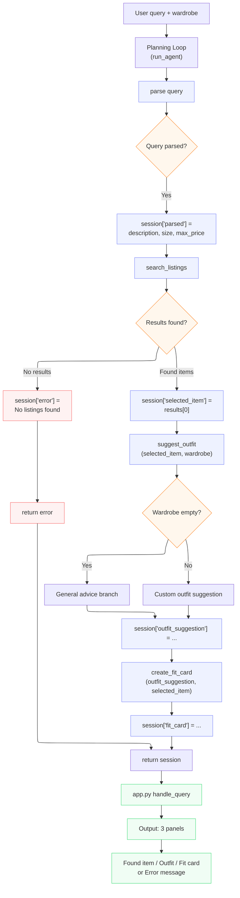

# FitFindr — planning.md

> Complete this document before writing any implementation code.
> Your spec and agent diagram are what you'll use to direct AI tools (Claude, Copilot, etc.) to generate your implementation — the more specific they are, the more useful the generated code will be.
> Your planning.md will be reviewed as part of your submission.
> Update it before starting any stretch features.

---

## Tools

List every tool your agent will use. For each tool, fill in all four fields.
You must have at least 3 tools. The three required tools are listed — add any additional tools below them.

### Tool 1: search_listings

**What it does:**
Searches the mock listings dataset for secondhand items that match the user's request. It filters listings by an optional size and an optional maximum price, then scores the remaining listings by keyword overlap between the user's description and each listing's text fields, returning the best matches first.

**Input parameters:**
- `description` (str): Free-text keywords describing the wanted item, e.g. `"vintage graphic tee"`. Used for relevance scoring against each listing's `title`, `description`, and `style_tags`.
- `size` (str | None): Size to filter by, e.g. `"M"`. Matching is case-insensitive and substring-based so `"M"` matches `"S/M"`. `None` skips size filtering.
- `max_price` (float | None): Inclusive price ceiling, e.g. `30.0`. Listings priced above this are dropped. `None` skips price filtering.

**What it returns:**
A `list[dict]` of matching listings sorted by relevance score (highest first). Each dict has the dataset fields: `id` (str), `title` (str), `description` (str), `category` (str), `style_tags` (list[str]), `size` (str), `condition` (str), `price` (float), `colors` (list[str]), `brand` (str | None), `platform` (str). Listings that score 0 on keyword overlap are excluded. Returns an empty list `[]` if nothing matches — it never raises.

**What happens if it fails or returns nothing:**
The function returns `[]` rather than raising. The planning loop detects the empty list, sets `session["error"]` to a specific, actionable message (e.g. *"No listings matched 'designer ballgown' in size XXS under $5. Try removing the size filter, raising your max price, or using broader keywords."*), and returns early **without** calling `suggest_outfit` or `create_fit_card`.

---

### Tool 2: suggest_outfit

**What it does:**
Given the item the user is considering and their current wardrobe, calls the LLM to propose 1–2 complete, wearable outfit combinations that pair the new item with specific named pieces from the wardrobe.

**Input parameters:**
- `new_item` (dict): A single listing dict from `search_listings` (the `selected_item`). The LLM is given its `title`, `category`, `colors`, and `style_tags` so suggestions match the piece.
- `wardrobe` (dict): A wardrobe dict shaped `{"items": [...]}`, where each item has `name`, `category`, `colors`, `style_tags`, and optional `notes`. May be empty (`items == []`).

**What it returns:**
A non-empty `str` of natural-language styling advice — typically 1–2 outfit ideas that name specific wardrobe pieces (e.g. "pair with your wide-leg khaki trousers and chunky white sneakers") plus a short styling tip. When the wardrobe is empty, it returns general styling advice for the item instead (what kinds of pieces pair well, what vibe it suits).

**What happens if it fails or returns nothing:**
If `wardrobe["items"]` is empty, the tool branches to a "general advice" prompt rather than naming nonexistent pieces — it still returns a useful string. If the LLM call itself errors (network/API), the tool catches the exception and returns a plain-English fallback string describing the item and suggesting it pairs with basics, so the agent stays usable and `create_fit_card` still has input.

---

### Tool 3: create_fit_card

**What it does:**
Generates a short, shareable social-media caption ("fit card") for the thrifted find, using the item details and the outfit suggestion. Runs at a higher LLM temperature so repeated calls on the same input produce varied captions.

**Input parameters:**
- `outfit` (str): The outfit suggestion string returned by `suggest_outfit`.
- `new_item` (dict): The same `selected_item` listing dict, used to mention the item `title`, `price`, and `platform` naturally in the caption.

**What it returns:**
A 2–4 sentence `str` written like a real OOTD post (casual, first-person, not a product blurb), mentioning the item name, price, and platform once each and capturing the outfit's vibe. Different inputs produce different captions.

**What happens if it fails or returns nothing:**
If `outfit` is empty or whitespace-only, the tool returns a descriptive error string (e.g. *"Can't write a fit card yet — no outfit suggestion was provided."*) instead of raising. If the LLM call errors, it catches the exception and returns a simple templated caption built from the item fields so the user still gets shareable text.

---

### Additional Tools (if any)

None for the required build. (Stretch candidate: `compare_price(item)` — estimate whether an item's price is fair against comparable listings in the same category. Will update this section before starting it.)

---

## Planning Loop

**How does your agent decide which tool to call next?**

`run_agent(query, wardrobe)` runs a single linear pass whose branches depend on what each tool returns — it is not a fixed "call all three" sequence. The logic:

1. **Initialize** a fresh `session` dict via `_new_session(query, wardrobe)`.
2. **Parse** the query into `description`, `size`, `max_price` and store them in `session["parsed"]`. (Parsing approach: regex/string extraction — pull `max_price` from a `$NN` or "under NN" pattern, `size` from a "size X" pattern or a known size token, and use the remaining words as `description`.)
3. **search_listings** with the parsed params → store in `session["search_results"]`.
   - **Branch (error path):** if `search_results == []`, set `session["error"]` to a specific message and `return session` immediately. `selected_item`, `outfit_suggestion`, and `fit_card` stay `None`. **suggest_outfit is not called.**
   - **Branch (success):** set `session["selected_item"] = search_results[0]` (top-scored) and continue.
4. **suggest_outfit**(`selected_item`, `wardrobe`) → store in `session["outfit_suggestion"]`. This tool internally branches on whether the wardrobe is empty, but the loop calls it either way because a non-empty item guarantees usable input.
5. **create_fit_card**(`outfit_suggestion`, `selected_item`) → store in `session["fit_card"]`.
6. **Return** the completed `session`.

The agent knows it is "done" when it reaches step 6 with a fit card, or when it returns early at step 3 with an error set. The behavior visibly differs between the two example queries: the graphic-tee query flows through all three tools; the "designer ballgown size XXS under $5" query stops after `search_listings`.

---

## State Management

**How does information from one tool get passed to the next?**

A single `session` dict (created by `_new_session`) is the one source of truth for the interaction. It carries:

- `query` (str) — original user input
- `parsed` (dict) — `{description, size, max_price}` extracted in step 2
- `search_results` (list[dict]) — output of `search_listings`
- `selected_item` (dict | None) — `search_results[0]`, the item that flows into both later tools
- `wardrobe` (dict) — passed in by the caller, consumed by `suggest_outfit`
- `outfit_suggestion` (str | None) — output of `suggest_outfit`, consumed by `create_fit_card`
- `fit_card` (str | None) — output of `create_fit_card`, the final shareable text
- `error` (str | None) — set only on early termination

Data flows by writing each tool's output into the session and reading it back out for the next call: `selected_item` is set once and passed unchanged into `suggest_outfit` **and** `create_fit_card`; `outfit_suggestion` is set by `suggest_outfit` and read by `create_fit_card`. The user never re-enters anything. `app.py`'s `handle_query` reads the finished session to populate the three output panels (or shows `session["error"]`).

---

## Error Handling

For each tool, describe the specific failure mode you're handling and what the agent does in response.

| Tool | Failure mode | Agent response |
|------|-------------|----------------|
| search_listings | No results match the query | Returns `[]`; the loop sets `session["error"]` to a specific message naming the query and suggesting concrete fixes (drop the size filter, raise max price, broaden keywords), and stops before the other tools run. |
| suggest_outfit | Wardrobe is empty | Detects `wardrobe["items"] == []` and prompts the LLM for general styling advice for the item (vibe, what pairs well) instead of naming pieces the user doesn't own — still returns a useful non-empty string. |
| create_fit_card | Outfit input is missing or incomplete | Guards against an empty/whitespace `outfit` and returns a descriptive error string ("no outfit suggestion was provided") rather than raising; on LLM errors it falls back to a templated caption from the item fields. |

---

## Architecture

---

## AI Tool Plan

**Milestone 3 — Individual tool implementations:**
I'll use **Claude (Claude Code)**, one tool at a time.
- *search_listings:* I'll paste the Tool 1 block above (inputs, return value, failure mode) and the listing field list, and ask Claude to implement it using `load_listings()` from `utils/data_loader.py`. Before trusting it I'll verify it (a) filters by `size` case-insensitively and `max_price` inclusively, (b) scores by keyword overlap and drops 0-score listings, and (c) returns `[]` (not `None`/exception) on no match. Then I'll run the three pytest cases (returns results, empty results, price filter).
- *suggest_outfit:* I'll give Claude the Tool 2 block plus the wardrobe schema, and ask it to call Groq `llama-3.3-70b-versatile`. I'll check it branches on empty `wardrobe["items"]` and wraps the LLM call in try/except. Verify by running it with `get_example_wardrobe()` and `get_empty_wardrobe()`.
- *create_fit_card:* I'll give Claude the Tool 3 block and ask for a higher-temperature LLM call. I'll verify the empty-outfit guard returns a string, and run it ~3× on the same input to confirm the captions vary.

**Milestone 4 — Planning loop and state management:**
I'll give Claude the **Architecture diagram**, the **Planning Loop** section, and the **State Management** section, and ask it to implement `run_agent()` in `agent.py` following the numbered steps. Before running I'll confirm it: branches on the empty `search_results` and returns early (does **not** call `suggest_outfit`/`create_fit_card` on the error path), stores each tool's output in the session dict, and reuses `selected_item` across both later tools. I'll verify by running `python agent.py` and checking the happy path fills `fit_card` while the no-results path sets `error` and leaves `fit_card = None`. For `handle_query` in `app.py`, I'll give Claude the State Management section and ask it to map the finished session to the three panels.

---

## A Complete Interaction (Step by Step)

FitFindr takes a natural-language request describing a secondhand item, then calls `search_listings` to find matches, `suggest_outfit` to combine the top result with the user's existing wardrobe, and `create_fit_card` to generate a shareable caption — passing state between calls so the user never re-enters anything. If `search_listings` returns nothing, the agent stops early and tells the user what to adjust instead of calling the remaining tools with empty input.

**Example user query:** "I'm looking for a vintage graphic tee under $30. I mostly wear baggy jeans and chunky sneakers. What's out there and how would I style it?"

**Step 1 — Parse + Search:**
The loop parses the query into `description="vintage graphic tee"`, `size=None`, `max_price=30.0` and calls `search_listings("vintage graphic tee", None, 30.0)`. It returns matching tops sorted by relevance (e.g. the *"Y2K Baby Tee — Butterfly Print" — $18, depop, excellent*, which has `style_tags` including `vintage` and `graphic tee`). The loop stores the list in `session["search_results"]` and sets `session["selected_item"]` to the top result. *(If the list were empty, the loop would set `session["error"]` and return here — `suggest_outfit` would not run.)*

**Step 2 — Suggest outfit:**
The loop calls `suggest_outfit(selected_item=<Y2K baby tee>, wardrobe=<example wardrobe>)`. The LLM pairs the tee with named pieces from the wardrobe — e.g. *"Tuck it into your baggy straight-leg dark-wash jeans, throw on the vintage black denim jacket, and finish with the chunky white sneakers for a Y2K street look."* This string is stored in `session["outfit_suggestion"]`.

**Step 3 — Fit card:**
The loop calls `create_fit_card(outfit=<that suggestion>, new_item=<Y2K baby tee>)`. The LLM returns a casual caption, e.g. *"found this butterfly baby tee on depop for $18 and it's so me 🦋 styled it with my baggy jeans + chunky sneaks, full fit in my stories."* Stored in `session["fit_card"]`.

**Final output to user:**
`app.py` reads the finished session and populates three panels: the found item (title, price, platform, condition), the outfit suggestion, and the shareable fit card. `session["error"]` is `None`, so no error is shown.
